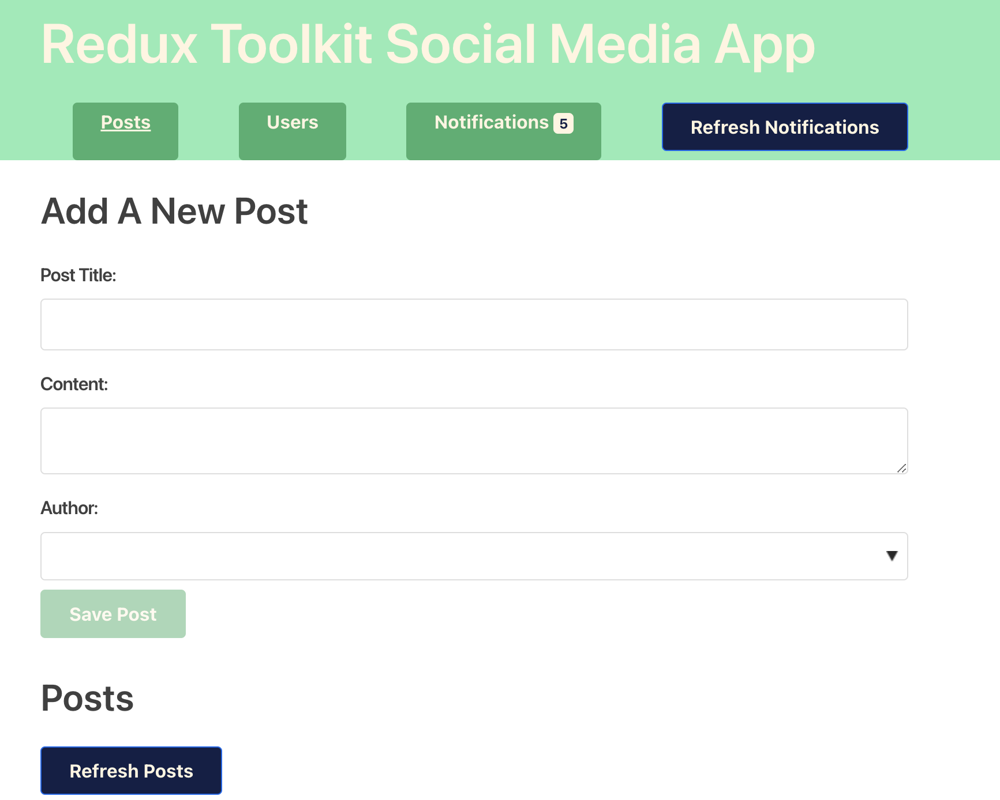
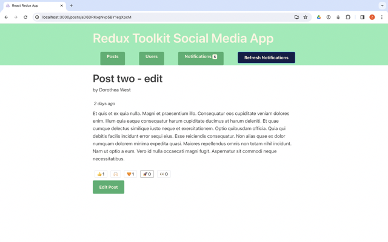

# Redux-Toolkit Social Media App



<hr>



## Technologies

This project is build with **React** using fake APIs & with dependencies:


- [Redux-toolkit](https://redux-toolkit.js.org/)

  This project contains the setup and code from the "Redux Essentials" tutorial in the Redux docs ( https://redux.js.org/tutorials/essentials/part-1-overview-concepts ).
  This project was bootstrapped with [Create React App](https://github.com/facebook/create-react-app), using the [Redux](https://redux.js.org/) and [Redux Toolkit](https://redux-toolkit.js.org/) template.

- [React Router](https://reactrouter.com/en/main)

## How to run it

Clone this repo:

```console
git clone https://github.com/zuzanakorma/react-social-media-app.git
```


## Available Scripts

In the project directory, you can run:

### `npm install`

### `yarn start`

Runs the app in the development mode.<br />
Open [http://localhost:3000](http://localhost:3000) to view it in the browser.

The page will reload if you make edits.<br />
You will also see any lint errors in the console.

### `yarn test`

Launches the test runner in the interactive watch mode.<br />
See the section about [running tests](https://facebook.github.io/create-react-app/docs/running-tests) for more information.

### `yarn build`


Builds the app for production to the `build` folder.<br />
It correctly bundles React in production mode and optimizes the build for the best performance.

